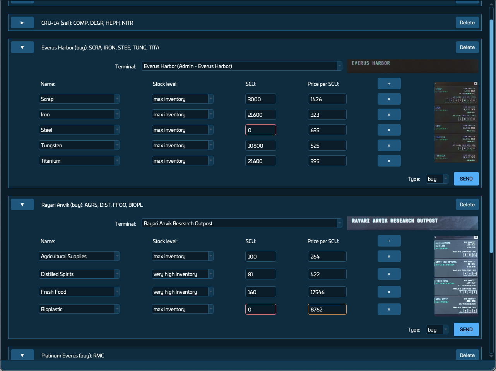
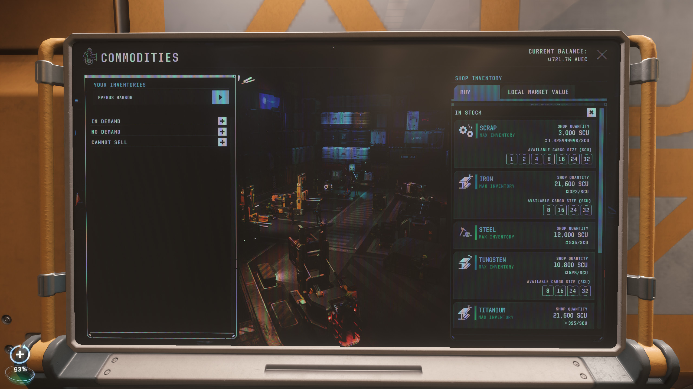
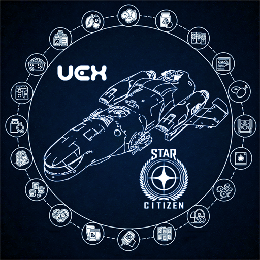

# Star Citizen Datarunner for UEX

A lightweight Windows desktop application for Star Citizen players to automate DataRunner tasks for the UEX Corporation website. Capture trading terminal screenshots, extract commodity data using Tesseract OCR, and submit it to the UEX API with a single click, contributing to a shared pool of trading information for the Star Citizen community.

## Features

- **Automated Screenshot Processing**: Capture commodity kiosk data by pressing <kbd>Print Screen</kbd> in-game.
- **Accurate Data Extraction**: Uses Tesseract OCR to extract terminal names, commodity details (name, SCU, stock level, price), and terminal type (buy/sell).
- **User-Friendly Interface**: Review, edit, and submit data with inline corrections and visual feedback.
- **Language Support**: Available in English (🇬🇧), with planned support for German (🇩🇪), Italian (🇮🇹), and others based on community interest.
- **Local Processing**: Screenshot processing is performed locally, with parsed commodity data and a perspective-corrected screenshot sent to the UEX API for verification.
- **Tutorial and Help**: Interactive tutorial on first launch and accessible via the Help menu.
- **Windows Support**: Optimized for Windows, the only platform supported by Star Citizen.
- [Known Issues](https://github.com/Shebuka/SC-Datarunner-UEX/issues?q=is%3Aopen+is%3Aissue+label%3Abug)

## Installation

1. Download the [latest release](https://github.com/Shebuka/SC-Datarunner-UEX/releases) `.zip` file from the "Assets" section.
2. Extract the `SC-Datarunner-UEX` folder to any location on your computer.
3. Ensure Star Citizen is installed (LIVE or PTU environment).

### Uninstalling

1. Delete the `SC-Datarunner-UEX` folder wherever you extracted it.
2. Optionally, remove the `config.ini` file from `%APPDATA%\SC-Datarunner-UEX` to fully clear settings.

## Usage

1. **Launch the Application**:
   - Double-click `SC-Datarunner-UEX.exe` in the extracted folder to start the application.
   - On first launch, complete the onboarding wizard to set your UEX API token and Star Citizen screenshot folder.
   - Follow the interactive tutorial to learn how to capture screenshots, select the game environment (LIVE/PTU), and use the app.

2. **Capture Screenshots**:
   - In Star Citizen, navigate to a trading terminal kiosk and open its inventory (Buy or Sell tab).
   - Ensure the inventory screen is visible, with the cargo deck image centered and commodity details listed.
   - Press <kbd>Print Screen</kbd> to capture the screen. Scroll and repeat to capture all commodities, ensuring the first commodity is fully visible.
   - Follow [Best Practices](#best-practices-for-screenshot-capture) for optimal OCR results.

3. **Review and Submit Data**:
   - Switch to the application to view extracted data in a list.
   - Check for fields highlighted in red/orange (indicating errors or low confidence) and correct them inline.
   - Click "Send" to submit individual entries or "Send All" to submit all entries at once to the UEX API.
   - Screenshots are saved to the `/screenshots` folder within the application directory.

4. **Access Help**:
   - Revisit the tutorial anytime via the "Help > Show Tutorial" menu.

### Best Practices for Screenshot Capture

- **Minimize Glare**: Position your character to reduce screen glare, or try a different terminal with better lighting.
- **Align Closely**: Stand as close and straight to the terminal as possible for maximum clarity.
- **Disable Hints**: Turn off in-game hints (Options > Game Settings > Show Hints, Control Hints) to avoid text overlap.
- **Avoid Overlays**: Ensure `r_DisplayInfo` or other overlays do not obscure the commodity list.
- **Scroll Carefully**: When scrolling, ensure the first commodity is fully visible to avoid partial data extraction.

## Frequently Asked Questions (FAQ)

### Why Use Star Citizen Datarunner?
This application streamlines the process of scraping commodity kiosk data, saving time and contributing valuable trading information to the UEX community. It automates data extraction and submission, making it seamless to support UEX's shared trading database.

### Where Are My Screenshots Processed?
All processing is performed locally on your computer, ensuring privacy and security.

### Is Any Data Shared with Third Parties?
Only the parsed commodity data (terminal name, commodity details) and a perspective-corrected screenshot are sent to the UEX API for data submission verification. These are published on [UEXCorp.space](https://uexcorp.space/data/home). No personal data or raw screenshots are shared.

### What If I Encounter Issues?
Check the [Known Issues](https://github.com/Shebuka/SC-Datarunner-UEX/issues?q=is%3Aopen+is%3Aissue+label%3Abug) page or file a new issue on the [GitHub repository](https://github.com/Shebuka/SC-Datarunner-UEX/issues).

## Disclaimer

Star Citizen Datarunner for UEX is a closed-source project. All rights are reserved by the developers. This application is not officially affiliated with UEX Corporation or Roberts Space Industries, the developers of Star Citizen.

## Acknowledgments

- [UEX Corporation](https://uexcorp.space/) for providing the API and community platform.
- [Tesseract OCR](https://github.com/tesseract-ocr/tesseract) for enabling robust text recognition.
- The Star Citizen community for inspiring this tool.
