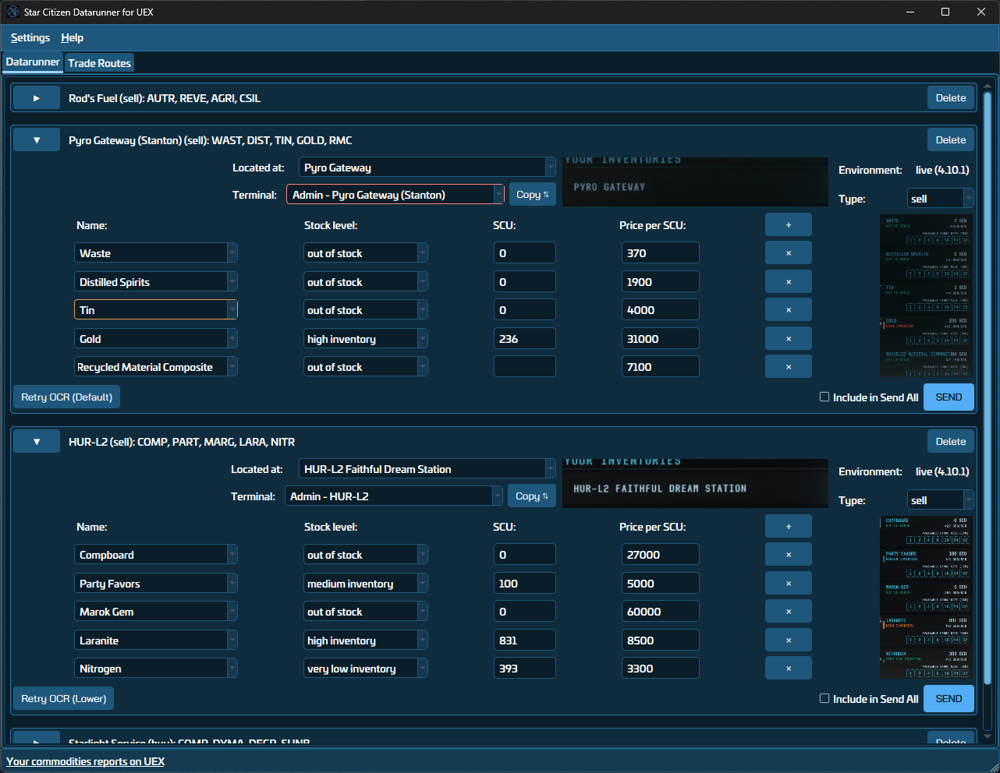
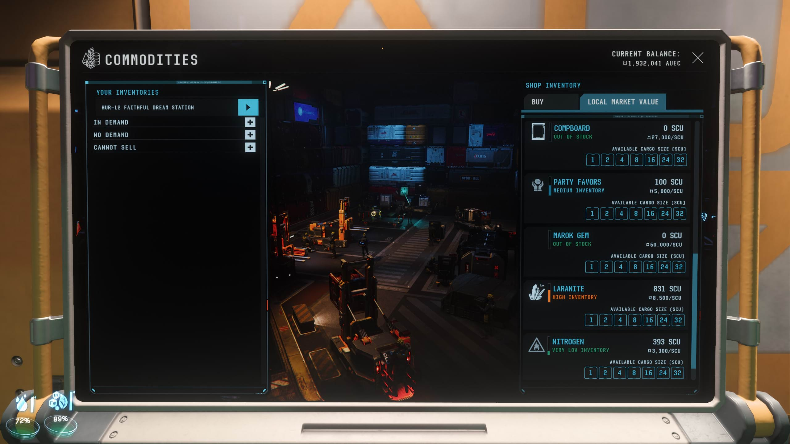
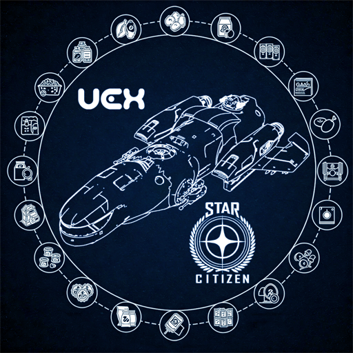

# Star Citizen Datarunner for UEX

A Windows desktop application for Star Citizen players to automate DataRunner tasks for the UEX Corporation website. Capture trading terminal screenshots with a single keypress, extract commodity data using PaddleOCR — which reads the Star Citizen kiosk font notably more precisely than the previous engine — and submit it to the UEX Website with one click, contributing to a shared pool of trading information for the Star Citizen community. Save time and effort with automated screenshot handling and precise data processing, including proper rounding of commodity prices, especially at busy locations with extensive commodity lists.

## Features

- **Automated Screenshot Processing**: Capture commodity kiosk data by pressing <kbd>Print Screen</kbd> in-game, eliminating the need for manual screenshot management.
- **Accurate Data Extraction**: Uses PaddleOCR, which reads the Star Citizen kiosk font notably more precisely than the previous engine, to extract terminal names, commodity details (name, SCU, stock level, price), and terminal type (buy/sell), including proper price rounding.
- **Reliable Terminal Assignment**: When multiple kiosks share the same location, the app uses color analysis to identify the correct one. If uncertain, it prompts you to select from a dropdown — preventing wrong submissions.
- **Trade Routes Companion**: A dedicated **Trade Routes** tab ranks destinations by urgency vs distance and urgency vs profit. Powered by offline star‑system routing and live UEX API price data, it suggests the optimal next terminal to visit — factoring in your ship's SCU capacity, stock availability, demand, and an optional investment budget. 🗺️💰
- **User-Friendly Interface**: Two‑tab layout (Datarunner + Trade Routes) keeps OCR workflow and route planning separate. Review, edit, and submit data with inline corrections and visual feedback in a collapsible list view. Copy terminal selections across submissions with one click, and opt individual entries in or out of batch sending.
- **Flexible Submission Workflow**: Send individual entries with "Send" or batch-submit all eligible entries with "Send All." A per-submission checkbox lets you exclude specific screenshots from batch sends.
- **Language Support**: The app now speaks your language — as long as your language is one that UEX speaks. 😄 Fully localized UI in English (🇬🇧), French (🇫🇷), German (🇩🇪), Spanish (🇪🇸), Simplified Chinese (🇨🇳), Brazilian Portuguese (🇧🇷), Russian (🇷🇺), and Italian (🇮🇹). The app follows your OS language by default and can be switched live from **Settings → General → Language** ("System Default" re-enables OS detection). This is the language of the app itself and is independent of your game: it never changes what gets captured or submitted.
- **Game Values In Your Game's Language**: Point **Settings → Advanced → Game Localization** at your Star Citizen `global.ini` (a merged community translation works too) and the commodity names, terminal display names, inventory statuses and buy/sell tab labels shown in the app match what you see on screen. Each path has the OCR script selector right under it, so the text on screen is read with the matching model. LIVE and PTU can use different files. **Leave both paths empty and the app uses the UEX English names, which is the default** — game localization is entirely optional.
- **Local Processing**: Screenshot processing is performed locally, ensuring privacy, with only parsed commodity data and a perspective-corrected screenshot sent to the UEX API for verification.
- **Automatic Screenshot Cleanup**: Optionally deletes original screenshots after their data has been successfully sent, keeping your folders tidy.
- **Tutorial and Help**: Interactive tutorial on first launch and accessible via the Help menu to guide users through the process, plus an About dialog with the version and the project links.
- **Starts While It Connects**: the window appears straight away and a status line over the tab area says what it is loading — the connection, your account, terminals, commodities and your game localization — so a slow API or a large `global.ini` is never a blank screen. ⏱️
- **Never A Dead Tab**: if your Secret Key is missing or no longer accepted, or your screenshots folder was never set or has since moved, the Datarunner tab says exactly what is missing and offers a button that opens Settings. The **Trade Routes** tab keeps working throughout, because its terminal list needs no account. 🚦
- **Windows Support**: Optimized for Windows, the only platform supported by Star Citizen.

## Installation

1. Download the [latest release](https://github.com/Shebuka/SC-Datarunner-UEX/releases) `.7z` file from the "Assets" section.
2. Extract the `SC-Datarunner-UEX` folder to any location on your computer.
3. Ensure Star Citizen is installed (LIVE or PTU environment). The bundled OCR model covers Latin, Chinese and Japanese out of the box, and Russian or Korean fetch an extra model once on first use; if your client runs in another language, see **Game Values In Your Game's Language** above.
4. Obtain your personal UEX Secret Key from [UEXCorp.space](https://uexcorp.space/account/home/tab/account_main#panel-secret-key) by logging into your account and scrolling to the Secret Key section on your account page.

### Uninstalling

1. Delete the `SC-Datarunner-UEX` folder wherever you extracted it.
2. Optionally, remove the `config.ini` file from `%APPDATA%\SC-Datarunner-UEX` to fully clear settings.

## Usage

1. **Launch the Application**:
   - Double-click `SC-Datarunner-UEX.exe` in the extracted folder to start the application.
   - On first launch, complete the onboarding wizard to enter your personal UEX Secret Key (from [UEXCorp.space](https://uexcorp.space/account/home/tab/account_main#panel-secret-key)) and select your Star Citizen screenshot folder.
   - There is no environment switch to set: the app watches your LIVE and PTU screenshot folders at the same time and takes the environment from the folder a screenshot came from.
   - Optionally open **Settings → Advanced → Game Localization** and point the app at your Star Citizen `global.ini` so commodity names, terminal display names, inventory statuses and buy/sell tab labels match your game's language, and set the OCR script next to it to the script your client shows. Skip it and everything works with the UEX English names.
   - Follow the interactive tutorial to learn how to capture screenshots and use the app.

2. **Capture Screenshots**:
   - In Star Citizen, navigate to the trading terminal you want to update.
   - Access the terminal, under 'Your Inventories' select the terminal's inventory, identifiable by the cargo deck image at the center and a list of commodities with their Available Cargo Sizes (SCU).
   - Press <kbd>Print Screen</kbd> to capture the screen. Scroll and repeat to capture all commodities, ensuring the first commodity is fully visible.
   - Follow [Best Practices](#best-practices-for-screenshot-capture) for optimal OCR results.

3. **Review and Submit Data**:
   - Switch to the application to view extracted data in a list.
   - Verify the terminal **Location** is correct; if multiple kiosks share the location, select the right one from the **Terminal** dropdown. Use the **Copy** button to quickly apply it to other submissions at the same location.
   - Check fields highlighted in red/orange (indicating errors or low confidence) and correct them if needed.
   - Click **Send** to submit individual entries, or check the **Include in Send All** box on relevant submissions and use **Send All** to batch-submit them at once to the UEX Website, associating submissions with your UEX account.
   - Sent screenshots can optionally be cleaned up automatically (enable in Settings).
   - Screenshots are saved to the `/screenshots` folder within the application directory.

4. **Access Help**:
   - Revisit the tutorial anytime via the "Help > Show Tutorial" menu.

### Best Practices for Screenshot Capture

- **Language**: the most reliable setup is the bundled model on an English client, which needs nothing configured. For other languages, configure the matching `global.ini` in **Settings → Advanced → Game Localization** so the app knows the on-screen wording of commodity names, terminal names and inventory statuses, and pick the OCR script for that environment — the bundled model covers Latin, Chinese and Japanese, and Russian or Korean download an extra model once. Expect to correct the occasional value by hand.
- **Minimize Glare**: Position your character to reduce screen glare, or try a different terminal with better lighting.
- **Align Closely**: Stand as close and straight to the terminal as possible for maximum clarity.
- **Disable Hints**: Turn off in-game hints (Options > Game Settings > Show Hints, Control Hints) to avoid text overlap.
- **Avoid Overlays**: Ensure `r_DisplayInfo` or other overlays do not obscure the commodity list.
- **Scroll Carefully**: When scrolling, ensure the first commodity is fully visible to avoid partial data extraction.

## Frequently Asked Questions (FAQ)

### Why Use Star Citizen Datarunner?
This application streamlines the process of scraping commodity kiosk data, saving time and effort for Star Citizen players. It automates screenshot capture and data extraction, properly rounds commodity prices, and simplifies submission to the UEX Website, making it ideal for busy trading locations with extensive commodity lists. Contribute valuable trading information to the UEX community with minimal hassle.

### Where Are My Screenshots Processed?
All processing is performed locally on your computer, ensuring privacy and security.

### Is Any Data Shared with Third Parties?
Only the parsed commodity data (terminal name, commodity details) and a perspective-corrected screenshot are sent to the UEX API for data submission verification, associated with your UEX account. These are published on [UEXCorp.space](https://uexcorp.space/data/home). No personal data or raw screenshots are shared.

### What If I Encounter Issues?
Check the [Known Issues](https://github.com/Shebuka/SC-Datarunner-UEX/issues?q=is%3Aopen+is%3Aissue+label%3Abug) page or file a new issue on the [GitHub repository](https://github.com/Shebuka/SC-Datarunner-UEX/issues).

## Disclaimer

All rights are reserved. Star Citizen Datarunner for UEX is not officially affiliated with UEX Corporation or Roberts Space Industries, the developers of Star Citizen.

## Acknowledgments

- [UEX Corporation](https://uexcorp.space/) for providing the API and community platform.
- [PaddleOCR](https://github.com/PaddlePaddle/PaddleOCR) for enabling robust text recognition.
- The Star Citizen community for inspiring this tool and providing valuable feedback.
